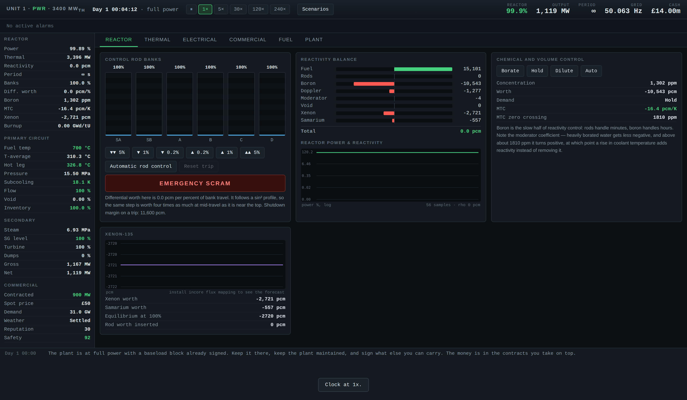
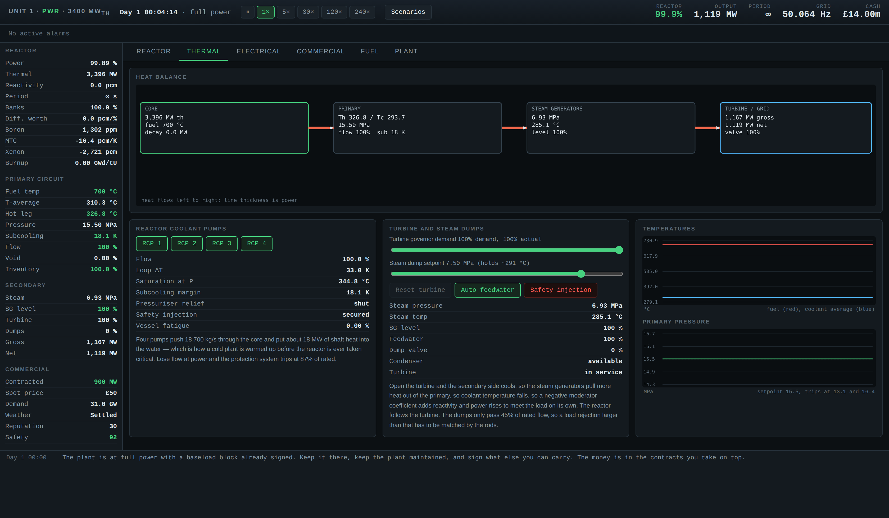

# Reactor

A nuclear power station management game where the reactor is simulated
properly.

You run a 3400 MW pressurised water reactor: six-group point kinetics with real
delayed neutron data, xenon-135 poisoning that will strand you in a pit for
nine hours if you mishandle a power reduction, Doppler and moderator feedback,
Wigner-Way decay heat that has to be removed after every trip, and a protection
system that will trip the plant whether or not you agree. You also run the
company that owns it, which has contracts, creditors, a regulator, and no
patience.

The difficulty is not artificial. It comes from the fact that a reactor is a
machine with several feedback loops operating on timescales from microseconds
to weeks, all of them pulling in different directions, and that the commercial
pressure to be at full power at 16:00 is completely indifferent to what the
iodine inventory is doing.



---

## Play it

**In the browser**, with nothing installed: <https://rowkav09.github.io/Project/>

That is the same simulation, running under Pyodide in the tab. First load
fetches the Python runtime and then everything is local — no server, no
requests, and it keeps running with the network unplugged.

**Locally**, which is faster and how it was designed to run:

```bash
git clone https://github.com/rowkav09/Project.git
cd Project
pip install -r requirements.txt
python3 app.py
```

Then open <http://localhost:5000>.

---

## What is actually modelled

| | |
|---|---|
| **Neutron kinetics** | Six delayed groups, Keepin U-235 data. Prompt jump approximation below prompt critical, 20 µs explicit integration above it. Reproduces the 55 s period at +100 pcm and the −80 s negative asymptote. Go prompt critical and the core is destroyed in about forty milliseconds. |
| **Xenon-135** | The full I-135/Xe-135 chain. −2720 pcm at equilibrium, peaking at −5200 pcm eight and a half hours after a trip. Samarium-149 too, which never goes away. |
| **Reactivity feedback** | Doppler on the √T resonance-broadening law. Moderator coefficient as a function of boron concentration — above 1810 ppm it goes positive, and the plant stops being self-regulating. Void coefficient, burnup, burnable absorber depletion. |
| **Control rods** | Differential worth following sin²(πx), so the same step is worth forty times as much at mid-travel as near the top. Bank sequencing with overlap. 2.4 %/s under the drive motors, 2.6 s to the bottom on a trip. |
| **Thermal hydraulics** | Fuel, coolant, steam generator and turbine nodes with real heat capacities. Steam tables accurate to half a kelvin. Pressuriser surge and relief. Pump coastdown and natural circulation. Zirconium-steam reaction above 1200 °C. |
| **Decay heat** | Wigner-Way. 6.5% of rated the instant the rods drop, which on this plant is 220 MW that has to go somewhere for the next several hours. |
| **Protection system** | Nine setpoints, 0.9 s from setpoint to rod release. It does not ask permission and it does not reset while a condition stands. |
| **The grid** | British demand shape with weather, wind and a seasonal swing. Frequency responds to supply-demand imbalance — trip the plant and you will see it. Hockey-stick spot pricing: negative on windy nights, several hundred pounds on a still winter evening. |
| **The business** | Six contract products, unannounced capacity tests, component wear on a bathtub hazard curve, regulatory inspections, and separative work maths exact enough that 4.5% fuel at 0.25% tails costs 9.22 kg of natural uranium and 6.87 SWU, which is what it costs. |

Some of it emerges rather than being coded. **The reactor follows the
turbine**: open the governor valve, the secondary side cools, the steam
generators pull more heat out of the primary, coolant temperature falls, the
negative moderator coefficient turns that into positive reactivity, and power
rises to meet the load without anybody touching a rod. That is genuinely how a
PWR behaves, and nothing in the code implements it directly.

---

## Scenarios

| | |
|---|---|
| **Commissioning** | Cold plant, fresh core. Warm the primary circuit on pump heat, dilute boron, pull rods to criticality, load the turbine. Watch the period. |
| **Baseload Operation** | A running plant and an order book to fill. |
| **Load Following** | Track national demand for a week with a reactor that hates being asked to. |
| **The Xenon Pit** | Xenon is climbing towards −5000 pcm and you have 1100 MW contracted for four this afternoon. Work out whether you can get there before you try. |
| **Station Blackout** | Full power, and the transmission line is about to go. |
| **End of Cycle** | Two thirds through the fuel cycle with no fuel on order and a twenty-two day outage ahead of you. |
| **Sandbox** | No consequences except physical ones. |



---

## Documentation

* **[PHYSICS.md](PHYSICS.md)** — every model in the simulation, the equations,
  where the constants come from, and an honest list of what is simplified.
* **[GAMEPLAY.md](GAMEPLAY.md)** — how to play, the five things that will kill
  you, how the money works, and how to read the instruments.
* **[ARCHITECTURE.md](ARCHITECTURE.md)** — how the code is put together and how
  to extend it.

---

## Development

```bash
pip install -r requirements-dev.txt
python3 -m pytest -q            # 144 tests
python3 tools/build_pages.py    # rebuild the browser edition in docs/
```

The tests are written as assertions about physics rather than as regression
snapshots: the 55 second period, the nine-hour xenon peak, the steam tables,
the SWU figures. If the model stops matching the textbooks, they fail.

The simulation lives in `reactorsim/` and uses nothing outside the Python
standard library. `app.py` serves it over HTTP; `docs/` runs the identical
package in the browser under Pyodide. `static/app.js` is used unchanged by
both — see [ARCHITECTURE.md](ARCHITECTURE.md).

The original prototype this grew from is kept in [`legacy/`](legacy/).

---

## Hosting the browser edition

`docs/` is committed, so GitHub Pages needs no build step:
**Settings → Pages → Source: Deploy from a branch → `main` / `docs`**.

Anything that runs Python can host the Flask version instead, which is faster
to load and lets several people watch the same plant.
